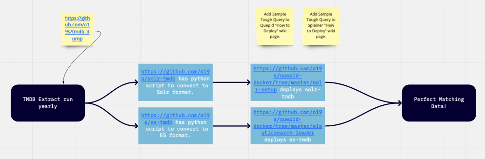

# What is it?

[TheMovieDB](http://themoviedb.org) is a Movie Database, useful for NLP, rescsys, and search experimentation. This repo crawls the TMDB API following the TMDB API rules, and places them into local gzipped JSON files so you can go forth and experiment with movie data.

OSC uses this dataset in it's [training classes](https://opensourceconnections.com/training/), which if you are into search, you will be interested in!

# Dependencies

- Python 3
- [Requests library](https://2.python-requests.org/en/master/)

# To Run

```
export TMDB_API_KEY=<get an API key from TMDB>
python tmdb.py
```

This script will crawl TMDB from 0 to the latest movie added to TMDB. Every 1000 movies will be dumped to the `chunks/` folder in gzipped json form.

In order to clean the data for use in public (remove Adult films etc) we have a second script that collects the results in `chunks/` and filters them into a single JSON file with ~ 50,000 English feature length films.

```
python scrub_and_shrink.py
```

This will produce a JSON file `tmdb_dump_{YYYY-MM-DD}.json`. The dating is to version the data so existing tutorials are not broken.



# Understanding Data Structure

You can use `jq` to parse the JSON.   Just unzip a chunk and then do:

> cat mychunk.json | jq .

Or, to look at a specific movie dataset, look it up by id:

> jq -c '.["702557"]' temp/tmdb.702.json | jq .
